# Xavier

[](https://github.com/lukenau/xavier/actions/workflows/ci.yml)
[](LICENSE)


**A personal AI hub you host yourself: a server you run, and an iPhone app that talks to it.**

Xavier is the server and app in front of a personal AI agent. You run the server
(a FastAPI service in Docker, called "the hub" throughout these docs) on a
machine you control: a VPS, a home server, or a Mac. The iOS app reaches it over
a private mesh such as Tailscale. The hub keeps your chat history, keys, files
and logs in one directory on that machine. There is no Xavier cloud and no
telemetry; what does leave the machine, and when, is spelled out under
[Privacy — plainly](#privacy--plainly).

The agent is **[Hermes Agent](https://hermes-agent.nousresearch.com/docs)** by
Nous Research, which you run alongside the hub. Hermes does the model calls, the
tool use, the scheduled jobs and the memory. Chat, automation sync and
transcripts reach the hub through the **hub-platform** Hermes plugin in this
repository, which you install into Hermes:
**[hermes-plugin/hub-platform/README.md](hermes-plugin/hub-platform/README.md)**.
Without Hermes and that plugin, the hub is a dashboard with a chat tab that
nothing answers.

The app is one Expo / React Native codebase, and iOS is the only platform it
targets. The web and Android targets build from the same tree for development,
but they are not distributed or supported. What the app does, feature by
feature, with the mechanism behind each claim and the outside pieces it needs:
**[docs/FEATURES.md](docs/FEATURES.md)**.

<p align="center">
  
  
  
  
  
  
</p>

**Models are chosen in Hermes.** Which model answers, and through which provider,
is set in Hermes's own configuration. [OpenRouter](https://openrouter.ai) is one
option there, putting many frontier models behind a single key. The hub never
calls a model itself: it reads `OPENROUTER_API_KEY` only to show your OpenRouter
credit balance and spend.

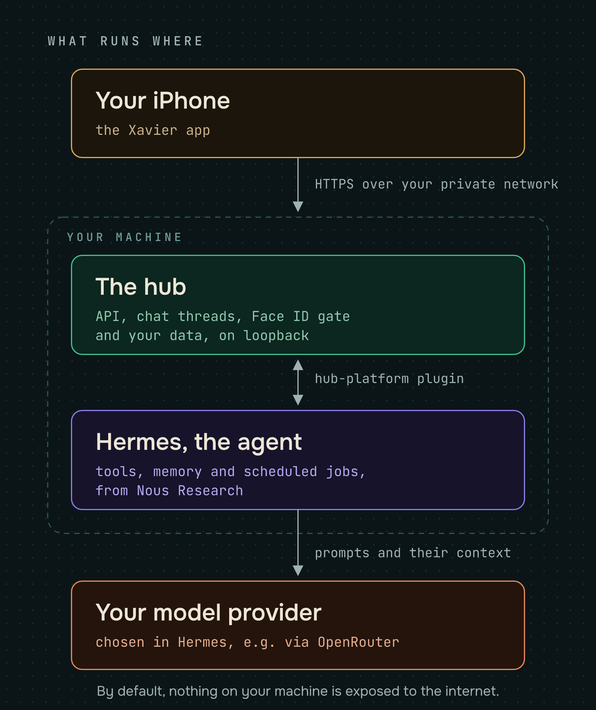

---

> **Getting the app.** A public TestFlight beta is coming, and its link will go
> here. Either way you need an HTTPS address for your server, because the app
> refuses `http://` for anything but `localhost`, and Hermes with the
> hub-platform plugin installed. To build your own copy instead, you also need:
>
> - an Apple Developer account ($99/year) and an Expo account, plus `eas init`
>   to create your own Expo project;
> - the identity variables `EXPO_OWNER`, `IOS_BUNDLE_IDENTIFIER` and
>   `EAS_PROJECT_ID`, exported in your shell or set as EAS project environment
>   variables.
>
> The whole path, from Expo project to TestFlight to over-the-air updates:
> **[docs/PUBLISH-APP.md](docs/PUBLISH-APP.md)**.

## Quick start

**You need:** a machine that stays on (VPS, home server, or Mac) with
[Docker](https://docs.docker.com/engine/install/), Docker Compose v2, and `bash`.
`curl` is used for the health check when present, with a built-in fallback if it
is not.

```bash
git clone https://github.com/lukenau/xavier.git
cd xavier
./install.sh
```

`install.sh` creates `.env` (mode 600), builds and starts the server, and waits
until `http://127.0.0.1:8090/api/healthz` answers. At that point the server is
reachable from that machine only. Three more steps put it in your pocket:

1. **Give the server an HTTPS address.** The recommended way is Tailscale, which
   keeps the hub on your private tailnet:

   ```bash
   sudo tailscale serve --bg --https=443 http://127.0.0.1:8090
   ```

   `./scripts/setup-mesh.sh` does the same and joins the tailnet first if needed.
   Put the resulting `https://<machine>.<tailnet>.ts.net` into `.env` as
   `HUB_PUBLIC_BASE` and `HUB_ORIGIN` (which also tells the server to answer to
   that host name), then re-run `./install.sh` to apply it.
   Never use `tailscale funnel`, which publishes the server to the whole
   internet.
   Cloudflare Tunnel, WireGuard and the other options are in
   [docs/MESH.md](docs/MESH.md).
2. **Point the app at it.** Type the address into the app's
   **Config → Server address**. No rebuild is needed; the field is validated when
   you save it, so it must be `https://`.
3. **Pair the phone.** Run `./install.sh --pair` on the server. It mints a
   one-time six-character code inside the running server over a local unix
   socket. There is no Face ID step here: shell access to the server is already
   full trust. Type the code into **Config → Security & approvals → Passkeys & Face ID → Face ID device key**
   within 120 seconds.

Then connect Hermes for chat:
[hermes-plugin/hub-platform/README.md](hermes-plugin/hub-platform/README.md).
More detail: **[docs/SETUP.md](docs/SETUP.md)** and
**[docs/CONNECT-APP.md](docs/CONNECT-APP.md)**.

---

## Pick your host

| Where you run it | Guide | Best for |
|---|---|---|
| **VPS** (Hetzner, DigitalOcean, OVH…) | [docs/INSTALL-VPS.md](docs/INSTALL-VPS.md) | always-on, reachable anywhere over your mesh |
| **Home server / NAS** | [docs/INSTALL-HOME-SERVER.md](docs/INSTALL-HOME-SERVER.md) | keeping data at home |
| **Mac** | [docs/INSTALL-MAC.md](docs/INSTALL-MAC.md) | trying it locally |

Each guide has a diagram and the exact commands. Read
**[docs/CONNECT-APP.md](docs/CONNECT-APP.md)** afterwards to give the server its
HTTPS address and pair the app, and **[docs/MESH.md](docs/MESH.md)** for the
network options: Tailscale, Headscale, WireGuard or Cloudflare Tunnel.

---

## What it looks like

<p align="center">
  
  
  
</p>

Stills from a demo build. Every name, number and order in them is fictional.

**Home, dark and light, then chat and calendar**

<p align="center">
  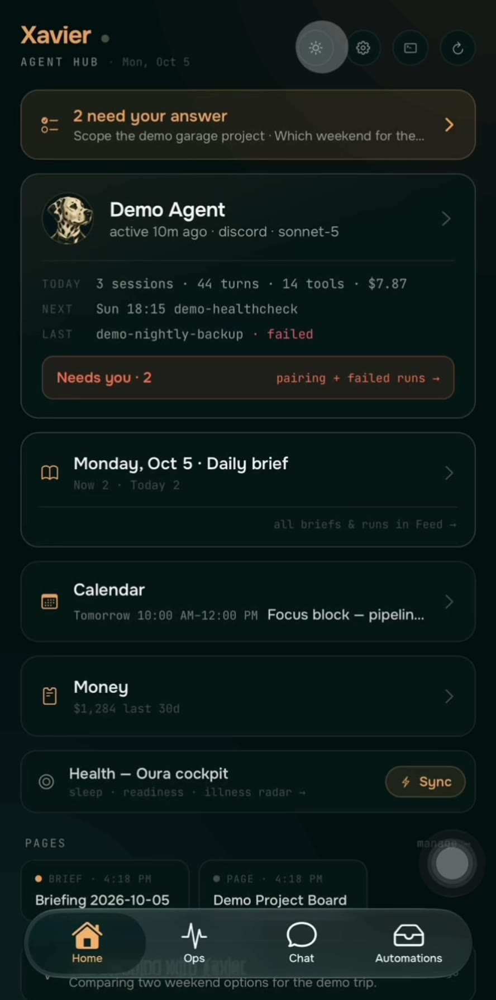
  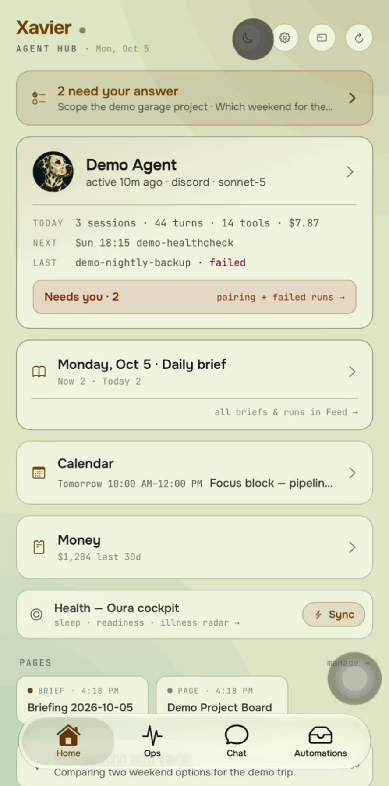
  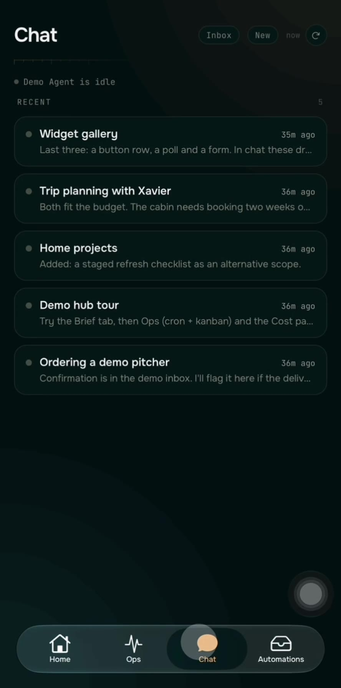
  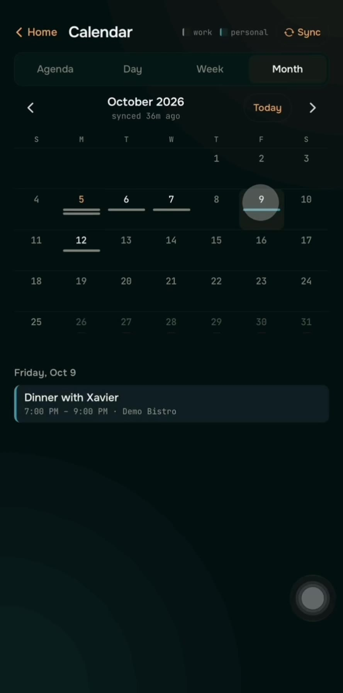
</p>

**A purchase, end to end.** The agent asks for a single-use card, capped at the
total and good for one merchant, and the receipt lands in the thread (a mock
purchase in the demo):

<p align="center">
  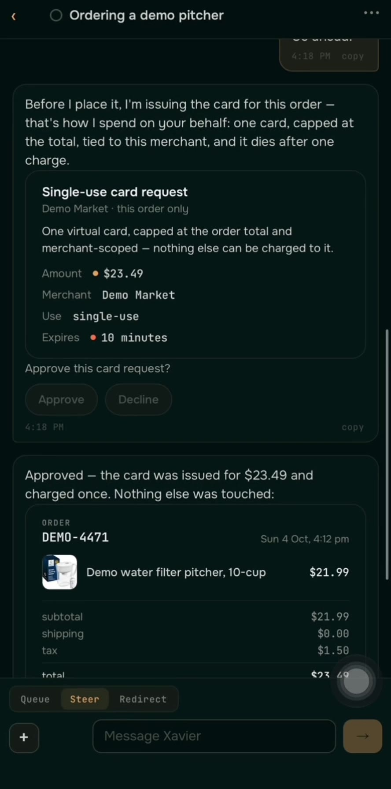
  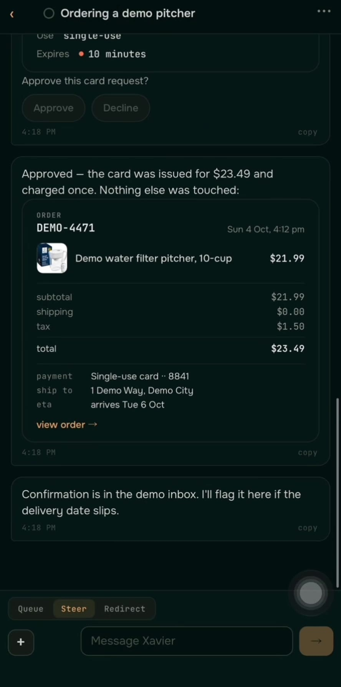
</p>

**Chat widgets**, the native cards a reply can carry:

<p align="center">
  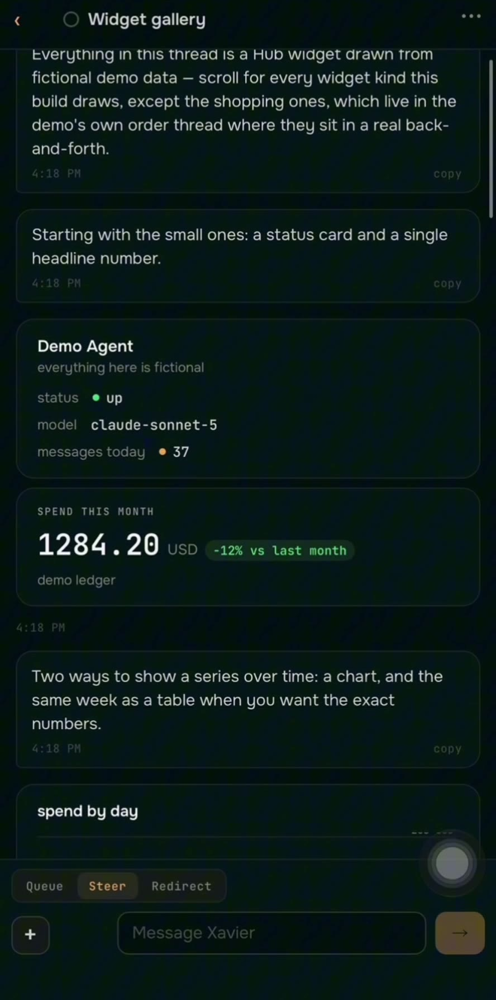
  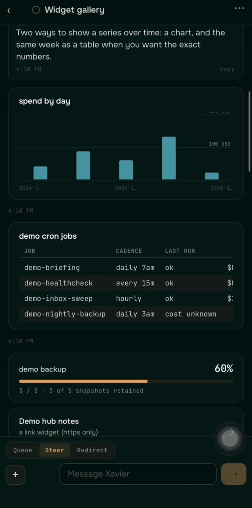
  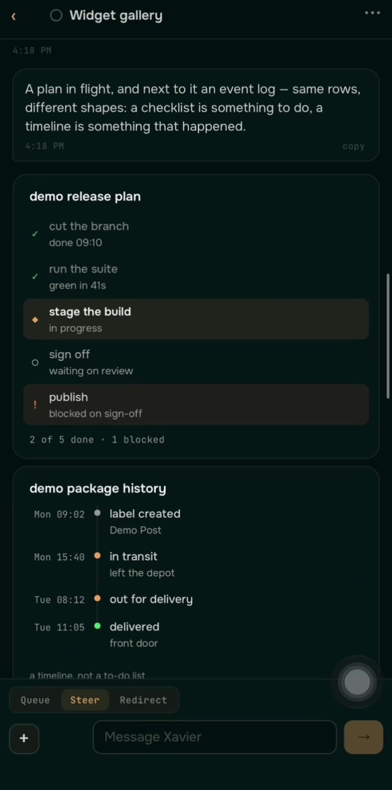
  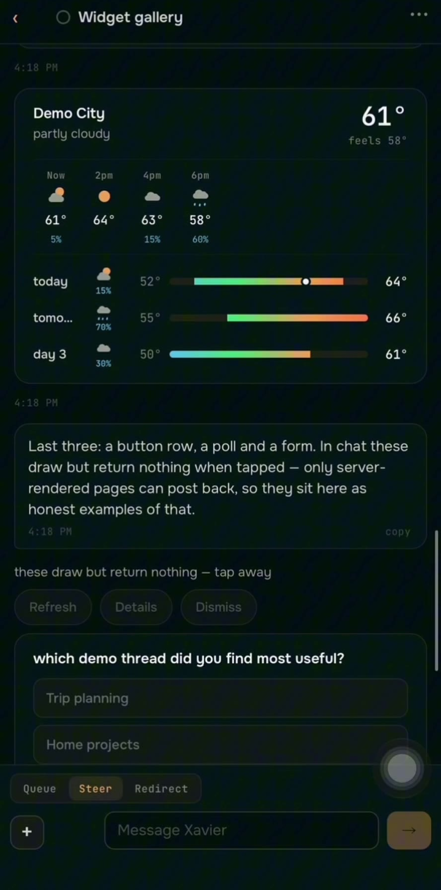
</p>

**Ops, spend and Face ID**

<p align="center">
  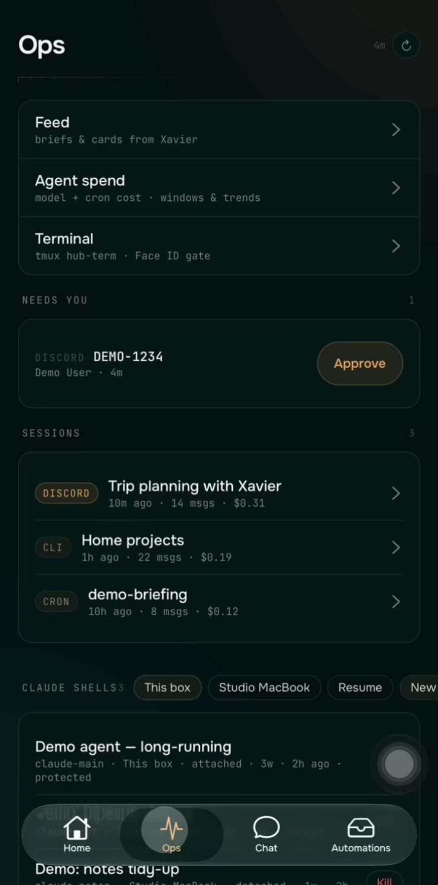
  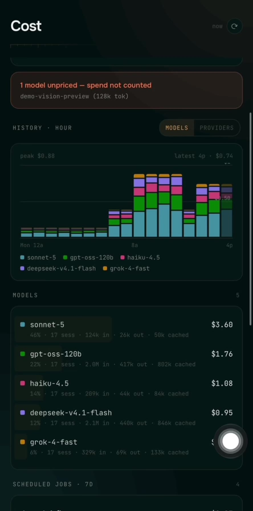
  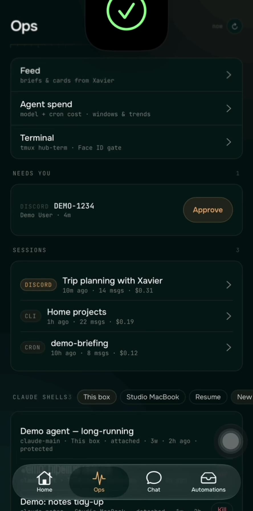
</p>

```
xavier/
├── install.sh              one-command bootstrap
├── docker-compose.yml      the server
├── .env.example            the settings install.sh starts from
├── server/                 hub-api, the FastAPI service (the "hub")
├── app/                    the Xavier iOS app (Expo / React Native)
├── hermes-plugin/          the hub-platform plugin you install into Hermes
├── hub-bridge/             opt-in sidecar for the Hermes config, cron and skills panels
├── host/                   opt-in terminal and Claude Code shells: ttyd + hub-tmuxd units
├── scripts/                mesh setup, over-the-air publishing, the publish gate
├── demo/                   the server with fictional data, for a look around
├── docs/                   setup, per-host installs, connecting the app, troubleshooting
└── assets/img/             diagrams and widget screenshots
```

---

## What actually does the work

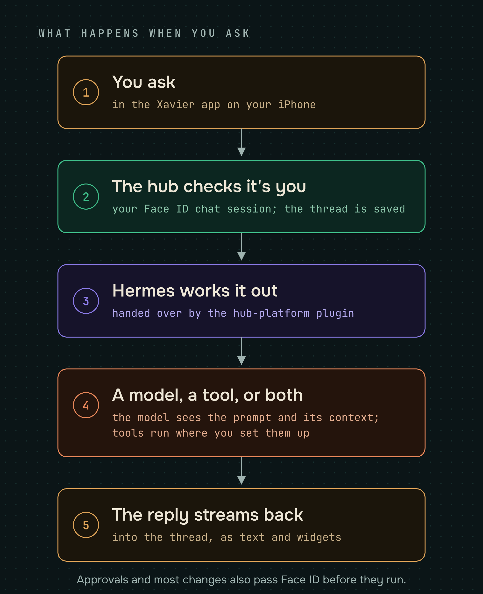

This repository is the **server, the app and the Hermes plugin**. The
intelligence behind them lives outside it, and it is worth being explicit about
which piece does what:

- **[Hermes Agent](https://hermes-agent.nousresearch.com/docs)** (Nous Research):
  the agent runtime. It does the model calls, tool use, scheduled jobs and
  memory. The hub talks to it directly (`HERMES_API_BASE`), and Hermes talks
  back through the hub-platform plugin, authenticated with a key both sides
  share. Install the plugin and you get chat, automations and transcripts in
  the app.
  This is the piece that makes the rest useful.
- **[OpenRouter](https://openrouter.ai)**: one way to give Hermes many models
  behind one key. The hub itself only reads your credit balance and spend.
- **[Supermemory](https://supermemory.ai)**: optional hosted long-term memory for
  Hermes. Hosted means the memories you store there leave your machine.
- **[Tailscale](https://tailscale.com)**: the private mesh that lets the app
  reach a server you never expose to the internet.
- **[Expo](https://expo.dev)** and **[React Native](https://reactnative.dev)**:
  the app, built with EAS. Push notifications go through Expo's push service,
  and over-the-air updates through EAS Update.
- **[FastAPI](https://fastapi.tiangolo.com)** and **[Docker](https://www.docker.com)**:
  the server, and how you run it.
- **ttyd** and **hub-tmuxd**: the host programs behind the terminal and the
  Claude Code shell picker. hub-tmuxd ships in [`host/`](host/README.md), with
  units that run it and ttyd (from your package manager) on unix sockets only.
  Opt-in, because it puts a real, Face-ID-gated shell on your machine; without
  it those surfaces stay locked or empty.
- **hub-bridge**: an opt-in sidecar, in this repository at
  [`hub-bridge/`](hub-bridge/README.md), that runs a fixed, allowlisted set of
  Hermes CLI commands for the config, cron, skills, plugins, MCP, memory, doctor
  and spend panels. It accepts only the hub's shared key and is off by default
  (the `bridge` Compose profile). In its default mode it holds the Docker socket,
  which is root-equivalent, so it runs on a private network with no published port.

None of these are bundled with Xavier except the plugin, hub-bridge and
hub-tmuxd. What is included, what is optional, and what happens when a service
is unset: **[docs/INTEGRATIONS.md](docs/INTEGRATIONS.md)**.

---

## Integrations — what's included, what isn't

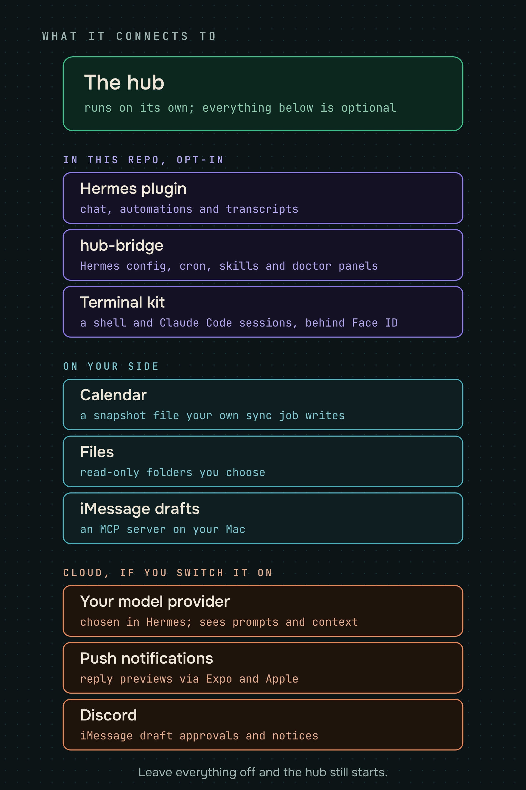

This repository is the **hub server, the app, and the Hermes plugin**, plus
two opt-in pieces that stay off until you turn them on: the
[hub-bridge](hub-bridge/README.md) sidecar and the [host kit](host/README.md)
(hub-tmuxd, and the units that run it and ttyd). It includes the code that
talks to several optional services but bundles none of the services
themselves: Hermes, the memory provider, iMessage, OpenRouter and ttyd all live
outside it. The hub starts with every integration unset; panels whose service is missing show an empty state instead of crashing.
Full breakdown: **[docs/INTEGRATIONS.md](docs/INTEGRATIONS.md)**; every setting,
with `.env` blocks: **[docs/SERVICES.md](docs/SERVICES.md)**; agent-side tool
connectors: **[docs/CONNECTORS.md](docs/CONNECTORS.md)**.

---

## Privacy — plainly

<p align="center">
  
</p>

There is no Xavier cloud, no account to create, and no server of ours in the
loop. The server has no telemetry, and the app has no analytics or
crash-reporting SDK. Data leaves your machine only to services you turn on:

```
 stays on your machine                       leaves only if you turn it on
 ───────────────────────────────────         ─────────────────────────────────────────────────────
 the hub's data dir: chat history,           → your model provider, via Hermes:
 attachments, device keys, push tokens,        every prompt and its context
 logs, the calendar and brief files          → exp.host (Expo), then Apple, when push is on:
                                               thread titles and the first ~140 characters of replies
 Hermes, with its own copy of each           → u.expo.dev, in builds with over-the-air updates:
 conversation and its local memory             update checks with a per-install client id
                                             → hosted memory or search you connect:
                                               whatever Hermes sends them
```

- **Your model provider sees your conversations.** Every prompt, with the context
  Hermes adds to it (history, memory, tool results), goes to the model provider
  configured in Hermes, through OpenRouter if that is what you chose.
- **Push goes through Expo and Apple.** When you allow notifications, the server
  POSTs the thread title and the first ~140 characters of each finished reply (or
  of an automation's report) to `https://exp.host`, which delivers it through
  Apple's push service.
- **Over-the-air updates check in with Expo.** A build made with an
  `EAS_PROJECT_ID` asks `u.expo.dev` for new JavaScript on launch, sending its
  runtime version, channel and a per-install client id to the EAS project of
  whoever built it.
- **Hosted memory and search** that you connect to Hermes (Supermemory, Exa,
  and the like) receive whatever Hermes sends them.
- **Everything else stays put.** What the hub stores lives in
  `${HUB_DATA_DIR:-./data}` on the machine you installed it on. The app talks
  to the server address you enter (plus the web addresses of any product photos
  the agent puts in a shopping card); an unconfigured build points at a
  placeholder (`https://hub.example.com`) that leads nowhere.
- **Loopback by default.** The server binds `127.0.0.1`, so nothing else can
  reach it until *you* add a mesh or a proxy. It never opens a port to the
  internet on its own.
- **No secrets in the repo.** `.env` is gitignored, and the publish gate
  (`scripts/publish-gate.sh`) scans for committed keys and private markers.

The same, claim by claim against the source: **[docs/PRIVACY.md](docs/PRIVACY.md)**.

---

## Security model

- The server binds to **loopback only** by default; nothing is reachable from
  the network until *you* put a mesh or proxy in front of it.
- **Chat needs Face ID; most other reads need only network reach.** Chat
  threads, messages, attachments and the live chat socket require a session
  cookie minted by a Face ID ceremony on a paired device. Most other reads carry
  no credential at all, including the agent's full session transcripts
  (`/api/sessions/{id}/messages`), the calendar, the brief, files under the
  configured roots, config and costs. Anything that can reach the port can read
  them, so keep the server on a private network.
  [SECURITY.md](SECURITY.md) lists the unauthenticated surface in full.
- **Most writes need a fresh Face ID signature**, bound to the exact change, from
  a phone whose Secure Enclave key is paired with the server. The few that use
  another credential, or none, are listed in
  [SECURITY.md](SECURITY.md#other-ways-in).
- **Pairing codes come from the server's shell.** `./install.sh --pair` mints a
  code with no ceremony, so anyone with a shell on the server can pair a phone.
- **Host names are checked.** The server answers only to host names it knows
  (the one in `HUB_ORIGIN`, `localhost`, and any listed in `HUB_ALLOWED_HOSTS`)
  and refuses the rest with a 421, which stops a web page you visit from reaching
  the hub through DNS rebinding.
- **Provided as-is, by one person, with no support commitment and no SLA.** You
  are responsible for how you expose your server; the software carries MIT's
  warranty disclaimer and nothing more. See [NOTICE.md](NOTICE.md).
- See [SECURITY.md](SECURITY.md) for the threat model and how to report issues.

---

## Sharing your server

Xavier is built for one person. If you let anyone else use your hub, you become
the operator of their data: read **[docs/PRIVACY.md](docs/PRIVACY.md)** first.

---

## How this compares to hosted personal agents

A hosted agent is the obvious alternative. If you have seen Meta's **Muse**,
this is the same idea with one thing moved: you run the machine instead of them,
and the model is whichever you configure instead of whichever they pick. Xavier
is the software to be that machine, on hardware you own or a server you rent,
under a license that lets you read and change every line.

The difference that matters is custody, not features. With a hosted agent your
files and transcript history live on someone else's computer, and it reaches
your accounts from there, under their terms. Here your files and history live on a
machine you run (on a rented server, the host's terms cover that disk), and the
agent works from there. What still leaves is
what the agent sends to the model provider and the services you connect, so
that leg is governed by those providers' terms. The trade is real and worth stating: a hosted
product is less work to start and is someone else's problem to keep running. If
you want zero setup, use one.

Full comparison, with sources and dated checks:
**[docs/COMPARISON.md](docs/COMPARISON.md)**.

---

## What it costs

Nothing here is a subscription, and there is no tier to unlock. The software is
free (MIT) and runs on a machine you already have or a small rented server. What you pay for is the parts you plug
into it. Figures below were checked against each vendor's own page in October
2026; everything is optional except model access and, for the phone app, Apple's
developer program.

| Thing | Cost | Shape |
|---|---|---|
| A machine to run it on | Free if you have one; otherwise the smallest plan at a VPS provider such as Hetzner, DigitalOcean or OVH, whose current prices are on their own pricing pages | Monthly, or one-time for hardware (~$150–350 for a ready-to-run home box) |
| Electricity, home server | ~$0.70–3.50/mo for a 5–25 W box | Utility |
| [OpenRouter](https://openrouter.ai) (if Hermes uses it) | Pay per token, plus a 5.5% fee on credit top-ups. About 20 free models, limited to 50 requests a day until you have bought $10 of credits. No published average spend | Per token, prepaid |
| [Tailscale](https://tailscale.com) | Free for personal use (6 users, unlimited devices). Paid from $8/user/mo | Free tier |
| [Cloudflare Tunnel](https://www.cloudflare.com) | Free (Zero Trust free plan) | Free |
| [Apple Developer Program](https://developer.apple.com/programs/) | $99/year, needed to build and install the app on an iPhone. Includes WeatherKit | Annual |
| [Browser Use](https://browser-use.com) | Free tier, then paid by usage | Optional |

**The short version:** if you already have a computer to leave on, the cheapest
sane setup is **$1–4/month** in electricity plus whatever your model use costs,
and Apple's **$99/year** if you want the phone app, which is the only hub client
that can chat. A typical setup with a small VPS and light paid model use runs
**$20–35/month**, plus the same $99/year.

Two honest blanks: OpenRouter publishes no average personal spend, so none is
quoted here, and hardware prices move with the market, so they are ranges.

---

## Documentation

**[docs/FEATURES.md](docs/FEATURES.md)** is the full feature list: what the app
does, the mechanism behind each claim, and what each one depends on. The rest, by
task:

- **[docs/SETUP.md](docs/SETUP.md)**: install and first run.
- **[docs/CONNECT-APP.md](docs/CONNECT-APP.md)**: give the server an HTTPS
  address and pair your phone.
- **[docs/MESH.md](docs/MESH.md)**: Tailscale, Headscale, WireGuard or
  Cloudflare Tunnel.
- **[docs/ARCHITECTURE.md](docs/ARCHITECTURE.md)**: the pieces, how they talk,
  and why.
- **[docs/INTEGRATIONS.md](docs/INTEGRATIONS.md)**,
  **[docs/SERVICES.md](docs/SERVICES.md)**,
  **[docs/CONNECTORS.md](docs/CONNECTORS.md)**: what is included, what is
  optional, and what happens when a service is unset.
- **[hermes-plugin/hub-platform/README.md](hermes-plugin/hub-platform/README.md)**:
  installing the Hermes plugin that chat needs.
- **[docs/PRIVACY.md](docs/PRIVACY.md)**: what the software does with data,
  claim by claim, against the source.
- **[docs/TROUBLESHOOTING.md](docs/TROUBLESHOOTING.md)**: symptom → fix.
- **[SECURITY.md](SECURITY.md)**: threat model and how to report issues.

Building and shipping the app yourself:
**[docs/PUBLISH-APP.md](docs/PUBLISH-APP.md)** (Expo project, App Store Connect
record, over-the-air updates), **[docs/BETA.md](docs/BETA.md)** (sharing your
build with a few people through TestFlight),
**[docs/PUBLIC-BUILD.md](docs/PUBLIC-BUILD.md)** (a second build with personal
features stripped), and **[docs/RELEASE-CHECKLIST.md](docs/RELEASE-CHECKLIST.md)**
(pre-submit checks).

---

## License

MIT for this project's own code; see [LICENSE](LICENSE). The bundled JetBrains
Mono and Onest fonts are not MIT: they stay under the SIL Open Font License 1.1,
with its text beside them in `app/assets/fonts/`. Every third-party component
(those fonts, the bundled xterm.js, and others) is listed with its license in
[THIRD-PARTY-NOTICES.md](THIRD-PARTY-NOTICES.md).

## Author

Built by **Luke Nau**: [GitHub](https://github.com/lukenau) · [LinkedIn](https://www.linkedin.com/in/lukenau).

Bug reports and pull requests are welcome; open an
[issue](https://github.com/lukenau/xavier/issues) to start. Contributions are
accepted under the Developer Certificate of Origin, so sign your commits
(`git commit -s`). See [CONTRIBUTING.md](CONTRIBUTING.md).
