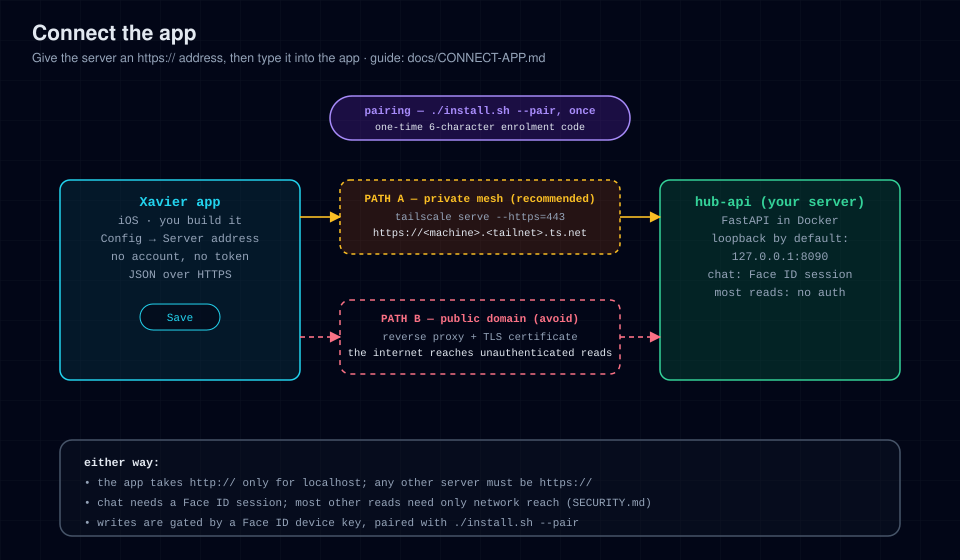

# Connect the app

The app needs one thing from your network: an **HTTPS address** for the server
that your phone can reach. This guide covers giving the server that address,
pointing the app at it, and pairing the phone.

> **How the app authenticates (read this).** There is no login and no token to
> type in. The app talks to the address you enter under
> **Config → Server address**. Chat and the terminal need a Face ID session from
> a paired phone, and most writes need a fresh Face ID signature, but most other
> reads, including the agent's session transcripts, need only network reach. So
> the network step below *is* the security step, not an optional extra. See
> [SECURITY.md](../SECURITY.md).



---

## Step 1 — Give the server an HTTPS address

By default the server publishes on `127.0.0.1` only: nothing outside the machine
it runs on can connect. The app, for its part, accepts `http://` only for
`localhost` and `127.0.0.1`; any other server must be `https://` with a
certificate the iPhone trusts. Pick **one** way to get there.

### Option A — Tailscale (recommended)

> Full step-by-step, plus Headscale, WireGuard and Cloudflare Tunnel:
> **[MESH.md](MESH.md)**.

An encrypted private network between your own devices, with a real certificate
and nothing exposed to the public internet. Works at home and away.

1. Install Tailscale on the server and on the iPhone, signed in to the same
   tailnet.
2. On the server, publish the loopback hub over the tailnet:

   ```bash
   sudo tailscale serve --bg --https=443 http://127.0.0.1:8090
   ```

   `./scripts/setup-mesh.sh` does this for you, and joins the tailnet first if
   needed. `--https=443` needs HTTPS certificates enabled for the tailnet in the
   Tailscale admin console; [MESH.md](MESH.md) covers this. Never use
   `tailscale funnel`: it publishes the server to the whole internet.
3. In `.env`, set the address Tailscale gives you. The scheme is `https`:

   ```ini
   HUB_PUBLIC_BASE=https://<machine>.<tailnet>.ts.net
   HUB_ORIGIN=https://<machine>.<tailnet>.ts.net
   ```

   `<machine>.<tailnet>.ts.net` is the full host name `tailscale serve status`
   prints. Setting `HUB_ORIGIN` also tells the server to answer to that host
   name; it refuses requests for names it does not know with a 421.
4. Re-run `./install.sh` (or `docker compose up -d`) to apply the new `.env`.

Your server address is then `https://<machine>.<tailnet>.ts.net`.

### Option B — another private network

Headscale, plain WireGuard, or Cloudflare Tunnel with device-based access each
work, with more moving parts; see [MESH.md](MESH.md). Whatever you choose must
end in an `https://` address the iPhone trusts, set as `HUB_PUBLIC_BASE` and
`HUB_ORIGIN` (add any other name you reach it by to `HUB_ALLOWED_HOSTS`).

### Not recommended — a public domain

You can put a TLS reverse proxy such as Caddy in front of the loopback port and
point a public domain at it:

```caddy
hub.example.com {
    reverse_proxy 127.0.0.1:8090
}
```

Think twice before you do. TLS encrypts the traffic, but every unauthenticated
read, agent transcripts included, is then open to anyone on the internet who
finds the address. A proxy that demands its own login would close that gap, but
the app cannot complete such a login, so it would lock the app out too. If you
go this way anyway, keep `HUB_BIND=127.0.0.1` so the proxy is the only way in,
set `HUB_PUBLIC_BASE` and `HUB_ORIGIN` to the domain, and read
[SECURITY.md](../SECURITY.md) first.

### Plain HTTP on your LAN does not work

An address like `http://192.168.1.50:8090` cannot work with the app, for two
reasons: the server binds `127.0.0.1`, so nothing else on your LAN reaches it,
and the app refuses `http://` for anything but `localhost` and `127.0.0.1`.
Binding wider (`HUB_BIND=0.0.0.0`) fixes only the first, and exposes every
unauthenticated read to every device on that network. Use Option A instead;
Tailscale connects directly over your LAN when the phone is at home.

---

## Step 2 — Point the app at it

Open **Config → Server address** in the app and type your server's address. This
value wins over everything else, and no rebuild is needed. If you never set it,
the app falls back to the build-time `expo.extra.apiBase`, and failing that to
the `https://hub.example.com` placeholder in `app/src/lib/api.ts`, which leads
nowhere. So:

- **To point a build at your server:** type the address into **Config → Server
  address**. The **Test** button checks it answers.
- **To bake a default into a build you ship:** set `expo.extra.apiBase` before
  building (see [PUBLIC-BUILD.md](PUBLIC-BUILD.md)).

The address must be `https://` unless it is `localhost` or `127.0.0.1`; the app
enforces that when you save the field.

---

## Step 3 — Pair the phone

Pairing is what lets this phone *write*, and read chat. Two machines are
involved:

1. **On the server machine:** run `./install.sh --pair`. It mints a one-time
   enrolment code inside the running server over a local unix socket: no browser,
   nothing over the network, and no Face ID ceremony. Shell access to the server
   is treated as full trust, so anyone who has it can pair a phone. (If you also
   run a passkey-gated Hub web UI, which is not part of this repository, it can
   mint the same code after a passkey prompt.)
2. **On the iPhone:** open **Config → Security & approvals → Passkeys & Face ID → Face ID device key** and type the
   code in before it expires. The code is six characters drawn from A–Z (without
   `I` or `O`) and 2–9 (without `0` or `1`); it is single-use and expires
   **120 seconds** after it is minted by default (`HUB_ENROLL_CODE_TTL_S` on the
   server).
3. The app generates a Secure Enclave key, posts the public half to
   `/api/devicekey/register`, and the phone is trusted. From then on, Face ID
   authorises writes on this phone and unlocks chat.

Most reads need no pairing: as soon as the app can reach the server, the home
screen loads live data. **Chat is the exception.** Its routes (threads,
messages, media, sends) all need the `hub_chat_session` cookie, minted by the
same Face ID device-key ceremony, so pairing turns on writes *and* chat.

**Success looks like:** the home screen loads live data instead of an empty or
error state.

## Step 4 — Connect Hermes

Chat, automations and transcripts need Hermes with the hub-platform plugin
installed, and `HERMES_API_BASE`, `HERMES_API_KEY` and a shared platform key set
on both sides:
[hermes-plugin/hub-platform/README.md](../hermes-plugin/hub-platform/README.md).
Until then the chat tab opens, but nothing answers.

---

### Running it in a browser (optional)

The same Expo app renders for the browser through `react-native-web`. Treat this
as a convenience for development, not as a way to use the hub. Nothing in the
pairing steps above depends on it.

```bash
cd app
npm install
npm run web          # dev server, live reload → http://localhost:8081
npm run build:web    # static web build → app/dist/
npm run check:web    # scan that artifact for leaked identifiers and secrets
npm run ios          # native: needs macOS + Xcode
npm run android      # native: needs Android SDK / emulator or device
```

`app/dist/` is a **single-page app served from the site root**: its assets are
referenced as `/_expo/…`, so serve it at `/`, not under a subpath (for example
`npx serve app/dist`). The web build resolves its server the same way the native
app does: **Config → Server address** first, then `extra.apiBase`, then the
placeholder. Passkeys are bound to `HUB_ORIGIN`, so a browser running the Expo
dev server (`http://localhost:8081`) is a *different* origin from the default
(`http://localhost:8090`); set `HUB_ORIGIN=http://localhost:8081` while you use
the dev server, or serve the build from the same origin as the API.

What the web build **is not**:

- **Not a replacement for the native app.** It cannot pair, chat or write: the
  app's write gate is the Secure Enclave device key, which exists only on a
  phone, and the browser build has no WebAuthn path of its own. It also has no
  Face ID, push notifications or native modules. At most it is a read-only view.
- **Not a PWA.** `expo export` writes a plain web bundle with no service worker
  and no web-app manifest, so it is not installable and has no offline mode.
- **Not the separate Hub web UI.** That is a different, private codebase, not
  part of this repository (the files under `app/src/shared` were ported from
  it); it is not needed to build or run this export.
- **Not distributed or supported.** Build it for yourself if you want it.

---

## Verify the connection

From any device that should be able to reach the hub:

```bash
curl -fsS https://<machine>.<tailnet>.ts.net/api/healthz
# → {"status":"ok"}
```

If that fails, the problem is network reachability, not the app; see
[TROUBLESHOOTING.md](TROUBLESHOOTING.md).

## Unpairing a phone

To revoke a phone's ability to *write* and open chat, delete its entry from the
server's `devicekeys.json` (or use a passkey-gated web UI, if you run one). No
new chat session can be minted with that key; one it already holds lasts until
it expires, an hour by default. That does **not** revoke the unauthenticated
reads, which still answer anything that can reach the port, so also remove the
device from the network that reaches the server (its tailnet membership, mesh
credentials, or LAN access). See [SECURITY.md](../SECURITY.md).
