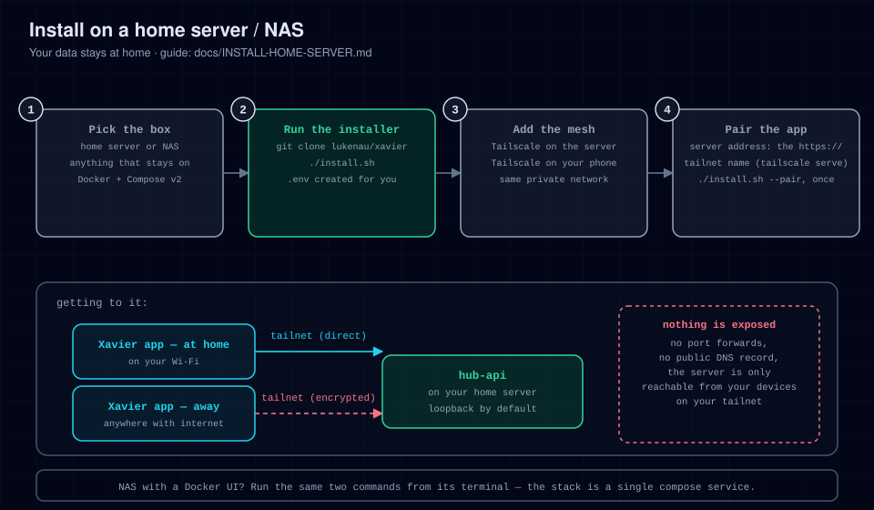

# Install on a home server / NAS

Run the hub on a box in your home: a mini PC, an always-on desktop, or a NAS that
supports Docker (Synology, QNAP, TrueNAS). Best when you want your data at home.



## Prerequisites

- Any Linux machine (or NAS) with [Docker Engine](https://docs.docker.com/engine/install/)
  and Docker Compose v2. On a NAS, use its built-in Container/Docker manager
  or SSH in.
- The box stays powered on (disable sleep).
- Tailscale on the box and on your phone, for the HTTPS address the app needs.

## Steps

1. **Install Docker + Compose v2** (skip on a NAS that already has it)

   ```bash
   curl -fsSL https://get.docker.com | sh
   sudo usermod -aG docker "$USER"   # log out and back in afterwards
   docker compose version            # must print a v2.x version
   ```

2. **Clone the repo**

   ```bash
   git clone https://github.com/lukenau/xavier.git
   cd xavier
   ```

3. **Run the installer**

   ```bash
   ./install.sh
   ```

   **Success includes:**

   ```
   ✔ Created .env (mode 600)
   ✔ hub-api is up  →  http://127.0.0.1:8090
   ```

4. **Verify**

   ```bash
   curl -fsS http://127.0.0.1:8090/api/healthz
   # → {"status":"ok"}
   ```

5. **Give it an HTTPS address with Tailscale.** This keeps the server
   loopback-only: nothing on your LAN or the internet can hit it directly, and
   the phone reaches it at home and away.

   ```bash
   curl -fsSL https://tailscale.com/install.sh | sh
   sudo tailscale up
   sudo tailscale serve --bg --https=443 http://127.0.0.1:8090
   tailscale serve status   # prints your https://<machine>.<tailnet>.ts.net URL
   ```

   The app then uses `https://<machine>.<tailnet>.ts.net`. At home, Tailscale
   connects directly over your LAN. `--https` needs HTTPS certificates enabled
   for the tailnet; see [MESH.md](MESH.md).

   A plain LAN address (`http://<server-ip>:8090`) does **not** work with the
   app: the server binds loopback, and the app refuses `http://` for anything
   but `localhost`. Binding `0.0.0.0` would only let every device on your
   network (guests, IoT gear) read the hub's unauthenticated surface. **Never
   port-forward 8090 to the internet.**

6. **Finish `.env`**

   ```ini
   HUB_PUBLIC_BASE=https://<machine>.<tailnet>.ts.net
   HUB_ORIGIN=https://<machine>.<tailnet>.ts.net
   HUB_TZ=America/New_York
   ```

   Setting `HUB_ORIGIN` also tells the server to answer to that host name.
   Apply it:

   ```bash
   ./install.sh    # recreates the container with the new env
   ```

7. **Point the app and pair it.** Type the address into
   **Config → Server address**, run `./install.sh --pair` on the server to mint
   a one-time 6-character enrolment code (no token, no login), and enter it under
   **Config → Security & approvals → Passkeys & Face ID → Face ID device key**. See
   [CONNECT-APP.md](CONNECT-APP.md).

8. **Connect Hermes** for chat:
   [hermes-plugin/hub-platform/README.md](../hermes-plugin/hub-platform/README.md).

## Autostart

`docker-compose.yml` sets `restart: unless-stopped`, so the hub comes back after
reboots as long as the Docker daemon starts at boot. It does by default on
systemd installs; enable it on NAS images if needed with
`sudo systemctl enable docker`. `tailscale serve --bg` keeps its configuration
across reboots too.

## Keeping it up to date

```bash
cd xavier
./install.sh --update
```

## Troubleshooting

See [TROUBLESHOOTING.md](TROUBLESHOOTING.md). Home-server-specific notes:

- App can't connect from your phone on the same Wi-Fi: check the phone is on
  the tailnet and that you typed the `https://…ts.net` address, not the LAN IP.
- NAS won't bind the port: check whether port 8090 is already used by a NAS
  service; set `HUB_PORT` in `.env` to a free port and re-run `./install.sh`
  (don't hand-edit `docker-compose.yml`), then point `tailscale serve` at the
  new port.
