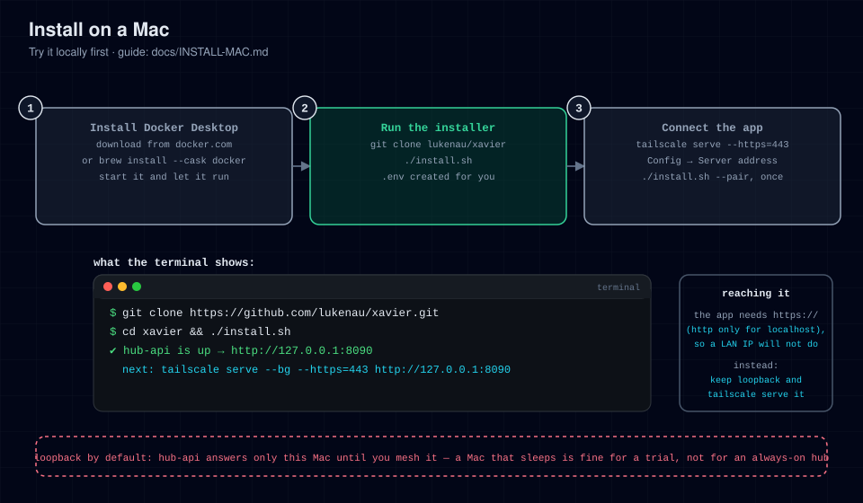

# Install on a Mac

Run the hub on a Mac. This page covers two different goals:

- **Try it locally**: install, start it when you want it, stop it when you
  are done. The [Steps](#steps) below are all you need.
- **Always-on headless server**: a Mac (often a Mac mini) left powered on
  and closed-lid on a shelf, running the hub around the clock. See
  [Running the Mac as a headless server](#running-the-mac-as-a-headless-server)
  after the basic install.



## Prerequisites

- macOS 13+ (Intel or Apple Silicon).
- **Docker Desktop** ([download](https://www.docker.com/products/docker-desktop/))
  or [OrbStack](https://orbstack.dev/). Docker Compose v2 ships with both —
  verify with `docker compose version`.
- Docker Desktop must be **running** (whale in the menu bar) whenever the
  hub should be up.

## Steps

1. **Install Docker Desktop** and launch it once so the daemon starts.

   ```bash
   docker compose version   # must print a v2.x version
   ```

2. **Clone the repo**

   ```bash
   git clone https://github.com/lukenau/xavier.git
   cd xavier
   ```

3. **Run the installer**

   ```bash
   ./install.sh
   ```

   First run builds the image (about a minute) and waits for health.

   **Success includes** (first run; on a later run the first line reads
   `✔ Existing .env found`):

   ```
   ✔ Created .env (mode 600)
   ✔ hub-api is up  →  http://127.0.0.1:8090
   ```

   The `http://127.0.0.1:8090` address works *on the Mac itself* (for `curl`
   or a browser). The app on your phone needs an `https://` address instead,
   which the next steps set up.

4. **Verify**

   ```bash
   curl -fsS http://127.0.0.1:8090/api/healthz
   # → {"status":"ok"}
   ```

5. **Give it an HTTPS address.** The Mac binds loopback by default, so other
   devices can't connect yet, and the app refuses `http://` for anything but
   `localhost`, so a LAN address will not do. Install
   [Tailscale](https://tailscale.com/download/mac) on the Mac and on your phone,
   then publish the hub over your tailnet:

   ```bash
   sudo tailscale serve --bg --https=443 http://127.0.0.1:8090
   tailscale serve status    # shows your https://<machine>.<tailnet>.ts.net URL
   ```

   Details and alternatives: [CONNECT-APP.md](CONNECT-APP.md) and
   [MESH.md](MESH.md). Never use `tailscale funnel`.

6. **Finish `.env`**

   ```ini
   HUB_PUBLIC_BASE=https://<machine>.<tailnet>.ts.net
   HUB_ORIGIN=https://<machine>.<tailnet>.ts.net
   HUB_TZ=America/Los_Angeles
   ```

   Setting `HUB_ORIGIN` also tells the server to answer to that host name.
   Apply it:

   ```bash
   ./install.sh    # recreates the container with the new env
   ```

7. **Point the app and pair it.** Type the address into
   **Config → Server address**, run `./install.sh --pair` on the Mac to mint a
   one-time 6-character enrolment code (no token, no login), and enter it under
   **Config → Security & approvals → Passkeys & Face ID → Face ID device key**. See
   [CONNECT-APP.md](CONNECT-APP.md). For chat, connect Hermes:
   [hermes-plugin/hub-platform/README.md](../hermes-plugin/hub-platform/README.md).

For a "try it locally" setup you are done: start Docker Desktop and run
`./install.sh` when you need the hub, `./install.sh --stop` when you don't.
A sleeping Mac is a down hub, which is fine here.

## Running the Mac as a headless server

Everything above keeps working; what changes is that the Mac now has to
stay up, start things on its own after a reboot, and stay reachable while
nobody is using it. Work through the subsections in order.

### 1. Power: on AC, and set to never sleep

Plug the Mac into mains power and leave it there. Then tell macOS not to
sleep:

```bash
sudo pmset -a sleep 0 disksleep 0 womp 1
```

What each flag does (`-a` applies the settings to every power source,
battery and AC alike):

- `sleep 0` — the system never sleeps. This is the one doing the real work.
- `disksleep 0` — never spin the disk down after idle time. Only matters
  on machines with spinning disks, harmless on SSDs.
- `womp 1` — Wake on Magic Packet: the Mac can also be woken from the
  network if it ever does end up asleep.

pmset options and their exact behavior vary a little across macOS
versions; check `man pmset` on your Mac if a flag misbehaves.

**The lid problem.** The settings above do not cover clamshell mode. On a
portable Mac, closing the lid normally forces sleep regardless of
`sleep 0`, unless an external display is driving it. There are two real
fixes:

- **Give it an external display** or an **HDMI dummy plug** (a small
  adapter that fakes a monitor). This is the supported way to run
  closed-lid, and on a shelf server the dummy plug is the usual choice.
- **Disable lid sleep**:

  ```bash
  sudo pmset -a disablesleep 1
  ```

  Honest caveat: this is an unsupported setting. It turns off all sleep,
  including what the lid closing triggers, and it removes a safety
  behavior; a closed Mac cannot shed heat as well as an open one, so
  watch thermals (see below). Undo it with `sudo pmset -a disablesleep 0`.

If you only need the Mac awake for a session rather than always, the
ad-hoc alternative is `caffeinate`:

```bash
caffeinate -s
```

`-s` prevents system sleep while the command runs and is only valid while
the Mac is on AC power. Stop it with Ctrl-C. It does nothing for the lid
problem; it just keeps an open, plugged-in Mac awake.

### 2. Docker Desktop must be running

The hub is a container, so nothing works unless the Docker daemon is up.

- Open Docker Desktop → **Settings → General** and enable **Start Docker
  Desktop when you sign in**. This is what makes the hub survive reboots.
- Check **Settings → Resources** and note the CPU and memory limits. The
  hub is a small single-container workload, so defaults are usually fine;
  just make sure the memory limit is not set absurdly low.

### 3. Start the hub after a reboot

Two layers do this job, and the first one is already in place:

1. **The container comes back on its own.** `docker-compose.yml` sets
   `restart: unless-stopped`, which means: as soon as the Docker daemon
   starts, the hub container starts with it, unless you explicitly
   stopped it. So if Docker Desktop starts at sign-in, the hub usually
   comes up without any extra work.
2. **A launcher for `./install.sh --start`** is the belt-and-suspenders
   layer: it also runs the health check and fails loudly if something is
   wrong. The easy path is a login item (System Settings → General →
   **Login Items & Extensions**, add the script or a wrapper). For a
   proper headless box, use a launchd agent instead. Create
   `~/Library/LaunchAgents/local.xavier.start.plist` (adjust the path to
   where you cloned the repo):

   ```xml
   <?xml version="1.0" encoding="UTF-8"?>
   <!DOCTYPE plist PUBLIC "-//Apple//DTD PLIST 1.0//EN"
     "http://www.apple.com/DTDs/PropertyList-1.0.dtd">
   <plist version="1.0">
   <dict>
     <key>Label</key>
     <string>local.xavier.start</string>
     <key>ProgramArguments</key>
     <array>
       <string>/Users/you/xavier/install.sh</string>
       <string>--start</string>
     </array>
     <!-- launchd's default PATH has no /usr/local/bin, where Docker Desktop puts docker -->
     <key>EnvironmentVariables</key>
     <dict>
       <key>PATH</key>
       <string>/usr/local/bin:/opt/homebrew/bin:/usr/bin:/bin:/usr/sbin:/sbin</string>
     </dict>
     <key>RunAtLoad</key>
     <true/>
   </dict>
   </plist>
   ```

   Then load it:

   ```bash
   launchctl bootstrap gui/$(id -u) ~/Library/LaunchAgents/local.xavier.start.plist
   ```

   Timing caveat: launchd fires the agent at sign-in, and if the Docker
   daemon is not ready yet, `install.sh --start` exits with "Cannot reach
   the Docker daemon". That is not fatal, because the container still
   comes back via `restart: unless-stopped` once Docker is up. Confirm
   with `./install.sh --status` a minute after boot.

### 4. Stay reachable: Tailscale on the Mac

The hub binds to `127.0.0.1:8090`, so other devices reach it through
Tailscale. Install the [Tailscale Mac app](https://tailscale.com/download/mac),
sign in, and publish the hub:

```bash
sudo tailscale serve --bg --https=443 http://127.0.0.1:8090
tailscale serve status    # shows your https://<machine>.<tailnet>.ts.net URL
```

`--https` needs HTTPS certificates enabled for the tailnet in the Tailscale
admin console — see [MESH.md](MESH.md).

Full setup, including the phone side, is in [MESH.md](MESH.md). One
server-specific note: the `<machine>` part of that URL comes from the
Mac's hostname when it joins the tailnet. If you rename the Mac later,
a re-authentication can hand out a new name, and every paired app needs
re-pointing. Keep the hostname stable, or pin the machine name in the
Tailscale admin console (Machines page), and treat the URL as permanent.

### 5. FileVault: a rebooted Mac stays locked

If the Mac has FileVault enabled, a reboot (including after a power cut)
leaves it sitting at the login screen, and **nothing** starts until
someone signs in: no Docker, no launchd agent, no hub. On a shelf server
with nobody home, that means the hub is down until a human unlocks it.

Your options, honestly stated:

- Accept it: after any power loss, walk over, unlock, done.
- Turn FileVault off for a dedicated headless server. That trades disk
  encryption for unattended boot; only do this on a machine whose data
  you are comfortable having on an unencrypted disk.
- For a *planned* restart, FileVault has a supported one-shot:

  ```bash
  sudo fdesetup authrestart
  ```

  You authenticate once; the Mac reboots and skips the login screen for
  that boot only. It does not help after an unexpected power cut.

### 6. Thermals and shelf placement

A Mac closed-lid and always-on generates heat with nowhere to go but the
case. Give it airflow: hard surface, not inside a cabinet or a drawer,
not on top of other warm gear, nothing piled on it. If it feels hot to
the touch or throttles, fix the placement before anything else.

Check what macOS itself thinks of the thermals:

```bash
pmset -g therm
```

This prints the current thermal pressure and scheduler limits; a healthy
machine shows all zeros there. The exact fields vary by model and macOS
version, so compare against your own baseline on a cool day rather than
against a universal value.

### 7. Verify the headless setup

After a reboot, with the lid closed and nobody signed in beyond the
login item, run:

```bash
docker ps                                      # hub-api shows Up (healthy)
curl -fsS http://127.0.0.1:8090/api/healthz    # {"status":"ok"}
tailscale serve status                         # your ts.net URL is listed
./install.sh --status                          # same view via the installer
```

If all four agree, the headless path works end to end.

## Keeping it up to date

```bash
cd xavier
./install.sh --update
```

## Troubleshooting

See [TROUBLESHOOTING.md](TROUBLESHOOTING.md). Mac-specific notes:

- `Docker daemon not reachable` → Docker Desktop isn't running. Launch it
  and wait for the whale icon, then retry. On a headless server, also
  check **Start Docker Desktop when you sign in** (see above).
- Port 8090 already in use → something else on the Mac claims it; set
  `HUB_PORT` to a free port in `.env` and re-run `./install.sh`, or stop the
  other service. (`HUB_PORT` is what the compose publish reads, and it survives
  `./install.sh --update` — don't hand-edit `docker-compose.yml`.)
- Hub is down after a reboot and won't come back → work through the
  [verification checklist](#7-verify-the-headless-setup). If the Mac has
  FileVault, someone has to unlock it first (see above).
