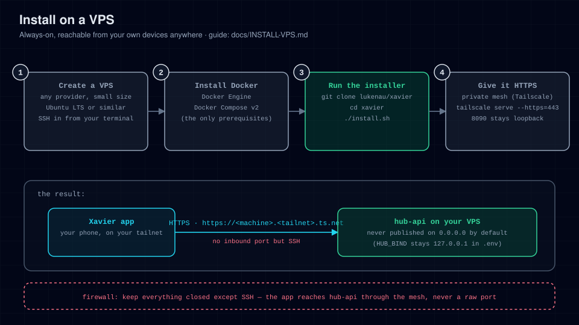

# Install on a VPS

Run the hub on a small cloud VM (any Debian 12 / Ubuntu 22.04+ box from Hetzner,
DigitalOcean, OVH, Linode, …). Best when you want it always on and reachable from
your own devices wherever you are.



## Prerequisites

- A VPS with at least 1 vCPU / 1 GB RAM, Debian 12 or Ubuntu 22.04+.
- SSH access as a sudo-capable user.
- Port `22` open. **Nothing else needs to be open**: the hub binds to loopback,
  and Tailscale reaches it without any inbound port.

## Steps

1. **Install Docker Engine + Compose v2**

   ```bash
   curl -fsSL https://get.docker.com | sh
   sudo usermod -aG docker "$USER"   # log out and back in afterwards
   docker compose version            # must print a v2.x version
   ```

2. **Clone the repo**

   ```bash
   git clone https://github.com/lukenau/xavier.git
   cd xavier
   ```

3. **Run the installer**

   ```bash
   ./install.sh
   ```

   First run builds the image (about a minute) and waits for health.

   **Success includes** (first run; on a later run the first line reads
   `✔ Existing .env found`):

   ```
   ✔ Created .env (mode 600)
   ✔ hub-api is up  →  http://127.0.0.1:8090
   ```

4. **Verify**

   ```bash
   curl -fsS http://127.0.0.1:8090/api/healthz
   # → {"status":"ok"}
   ```

5. **Lock down the firewall** (optional but good practice; the hub itself is
   already loopback-only)

   ```bash
   sudo ufw allow OpenSSH
   sudo ufw enable
   ```

6. **Give it an HTTPS address with Tailscale.** Install Tailscale on the VPS and
   on your phone, signed in to the same tailnet:

   ```bash
   curl -fsSL https://tailscale.com/install.sh | sh
   sudo tailscale up
   sudo tailscale serve --bg --https=443 http://127.0.0.1:8090
   tailscale serve status   # prints your https://<machine>.<tailnet>.ts.net URL
   ```

   The app then uses that full `https://<machine>.<tailnet>.ts.net` address.
   Tailscale terminates HTTPS for it, and it is never exposed to the public
   internet. `--https` needs HTTPS certificates enabled for the tailnet in the
   Tailscale admin console; [MESH.md](MESH.md) covers that, and the other
   options. Never use `tailscale funnel`.

   A public domain behind a TLS reverse proxy also works technically, but it
   puts the hub's unauthenticated reads, agent transcripts included, on the
   internet; read the warning in [CONNECT-APP.md](CONNECT-APP.md) first.

7. **Finish the environment.** Edit `.env` to match the address:

   ```ini
   # The exact origin the app uses, then your timezone. Keep comments on their
   # own lines: ./install.sh reads these values as written.
   HUB_PUBLIC_BASE=https://<machine>.<tailnet>.ts.net
   HUB_ORIGIN=https://<machine>.<tailnet>.ts.net
   HUB_TZ=Europe/Berlin
   ```

   Setting `HUB_ORIGIN` also tells the server to answer to that host name.
   Then apply it:

   ```bash
   ./install.sh    # recreates the container with the new env
   ```

8. **Point the app and pair it.** In the app, type the address into
   **Config → Server address**. Then run `./install.sh --pair` on the server to
   mint a one-time 6-character enrolment code (no token, no login) and enter it
   under **Config → Security & approvals → Passkeys & Face ID → Face ID device key**. Details in
   [CONNECT-APP.md](CONNECT-APP.md).

9. **Connect Hermes** for chat:
   [hermes-plugin/hub-platform/README.md](../hermes-plugin/hub-platform/README.md).

## Keeping it up to date

```bash
cd xavier
./install.sh --update
```

Run it weekly or on demand. Data persists in `HUB_DATA_DIR` (`./data`).

## Troubleshooting

See [TROUBLESHOOTING.md](TROUBLESHOOTING.md). VPS-specific notes:

- `docker: permission denied`: you skipped the `usermod -aG docker` step or
  didn't log in again.
- Nothing answers on 8090 from another machine: that is the default
  (`HUB_BIND=127.0.0.1`). Use the Tailscale address instead of binding
  `0.0.0.0`.
