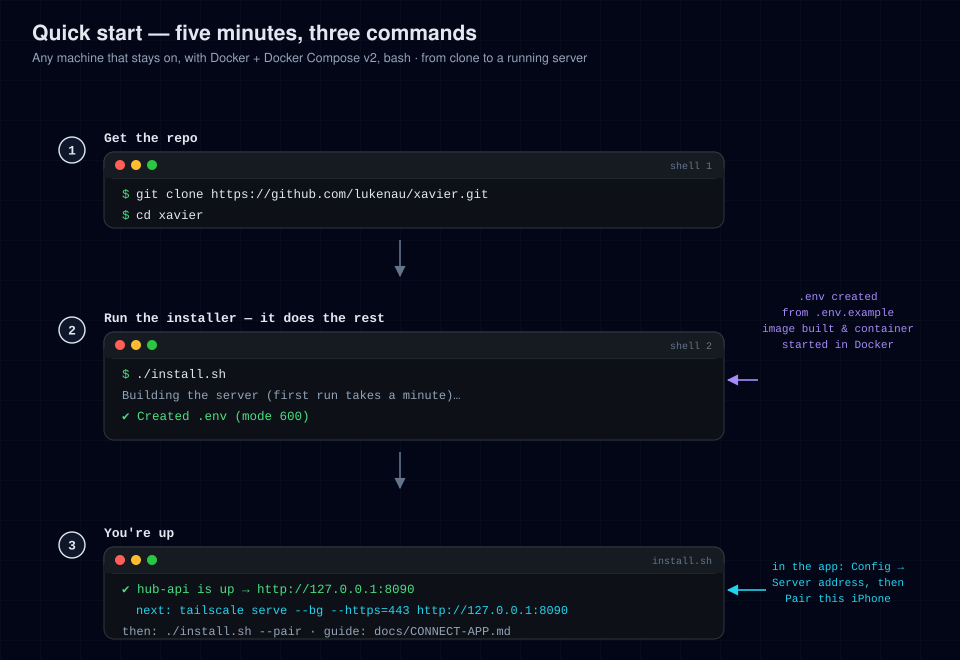

# Setup

This is the main setup guide. It covers the one-command quickstart that works on
any host, what `install.sh` actually does, and the main configuration options.
For host-specific detail (VPS, home server, Mac) see the dedicated guides.

---

## Quickstart

**You need:** a machine that stays on, with [Docker Engine](https://docs.docker.com/engine/install/)
and Docker Compose v2 (`docker compose version` must work), and `bash`.

```bash
git clone https://github.com/lukenau/xavier.git
cd xavier
./install.sh
```

On a first run, success includes these two lines:

```
✔ Created .env (mode 600)
✔ hub-api is up  →  http://127.0.0.1:8090
```

On any later run the first line is `✔ Existing .env found` instead (the
installer leaves an existing `.env` untouched), and the `hub-api is up` line
prints your `HUB_PORT`, `8090` by default.

The server now answers on that machine only. Next:

1. **Give it an HTTPS address** so your phone can reach it. The app accepts
   `http://` only for `localhost`, so a LAN address will not work. The
   recommended way is `sudo tailscale serve --bg --https=443 http://127.0.0.1:8090`;
   see [CONNECT-APP.md](CONNECT-APP.md) and [MESH.md](MESH.md).
2. **Pair the app.** There is no token or login: you mint a one-time enrolment
   code on the server machine with `./install.sh --pair` and type it into the
   app.
3. **Connect Hermes** for chat, automations and transcripts:
   [hermes-plugin/hub-platform/README.md](../hermes-plugin/hub-platform/README.md).



---

## What `install.sh` does

In order:

1. **Checks prerequisites**: Docker present, Docker Compose v2 present, Docker
   daemon reachable. Any miss exits with a plain-English error.
2. **Creates `.env`** from `.env.example` (only if it doesn't exist), sets mode
   600, and seeds the timezone from the system. An existing `.env` is kept
   untouched.
3. **Builds and starts** the server with `docker compose up -d --build`, after
   creating the data directory with the right owner.
4. **Waits for health**: polls `http://127.0.0.1:${HUB_PORT}/api/healthz`
   (`8090` by default) every 2 s for up to 90 s, then points you at the logs if
   it never came up.
5. **Prints next steps**: the loopback address it runs on, how to give it an
   `https://` address, and how to pair.

`install.sh` modes (`./install.sh --help` prints all of them):

| Command | Effect |
|---|---|
| `./install.sh` / `--start` | Install or start (the default; steps above). Re-running it also applies `.env` changes |
| `./install.sh --pair` | Mint a one-time device enrolment code, locally |
| `./install.sh --update` | `git pull --ff-only`, rebuild, restart |
| `./install.sh --stop` | `docker compose down` (your data is kept) |
| `./install.sh --restart` | Recreate the container (`docker compose up -d --force-recreate`), which re-reads `.env` |
| `./install.sh --logs` | Follow container logs (last 100 lines) |
| `./install.sh --status` | Show container state and health (`docker compose ps`) |
| `./install.sh --url` | Print the `https://` address the app should use (the one in `HUB_ORIGIN`), or how to get one if none is set |
| `./install.sh --uninstall` | Stop and delete all data (asks for confirmation; `.env` is kept) |

---

## Configuration

All settings live in `.env` (copied from `.env.example`). The important ones are
below; [SERVICES.md](SERVICES.md) covers every optional integration.

### Server / network

| Variable | Default | Meaning |
|---|---|---|
| `HUB_BIND` | `127.0.0.1` | Host-side publish address. `127.0.0.1` = reachable from this machine only. Leave it; a mesh or proxy on the same machine connects to loopback. See [CONNECT-APP.md](CONNECT-APP.md). |
| `HUB_PORT` | `8090` | Host-side port the server is published on. The container always listens on `8090` internally; this moves only the host side. Set it in `.env` (or the environment): `docker-compose.yml` reads `${HUB_PORT:-8090}`, so don't hand-edit the compose file. If you change it, point your mesh or proxy at the same port. |
| `HUB_ALLOWED_HOSTS` | *(empty)* | Extra host names the server answers to. It always answers to the host in `HUB_ORIGIN` and to `localhost`, `127.0.0.1` and `::1`; a request for any other host gets a 421, which blocks DNS rebinding. Add a name here only if you reach the hub by one that is not in `HUB_ORIGIN`. |
| `HUB_UID` | `1000` | uid the container runs as. `install.sh` keeps it in step with the owner of `HUB_DATA_DIR` so the non-root container can write its database and uploads. Set it by hand only if you moved the data dir to a different owner. |
| `HUB_DATA_DIR` | `./data` | Host directory persisted into the container at `/data` (database, uploads, keys). |

The host **port** comes from `HUB_PORT`; `docker-compose.yml` publishes
`"${HUB_BIND:-127.0.0.1}:${HUB_PORT:-8090}:8090"`. Setting it in `.env` also
survives `./install.sh --update`, which a hand-edit of the compose file would
not.

### Identity / pairing

| Variable | Default | Meaning |
|---|---|---|
| `HUB_ORIGIN` | `http://localhost:8090` | **The origin a browser uses to reach the hub** (scheme + host + port). Required for passkeys (a browser client of your own; the app pairs a device key instead): WebAuthn binds credentials to it, so it must match the address bar. Leave it blank and passkey setup is refused with an error naming this variable. Comma-separated list; the first entry is the WebAuthn origin. Set it to your HTTPS address once you have one. |
| `HUB_RP_ID` | *(derived)* | Relying-party host name the passkeys are scoped to. Derived from `HUB_ORIGIN`; set it only when it must differ (e.g. `hub.example.com`). |
| `HUB_PUBLIC_BASE` | `http://localhost:8090` | Base URL the server advertises to clients, for example in notification links. Set it to the address the app actually uses. |
| `HUB_USER_NAME` / `HUB_USER_HANDLE` | `user` / `hub-user` | The user name and handle a passkey is registered under, shown in the passkey prompt. |
| `HUB_TZ` | `UTC` | IANA timezone name (`Europe/Berlin`) for anything time-formatted. An unknown value logs a warning and falls back to UTC. |

### Optional integrations

All blank by default; the hub starts without any of them:

- `HERMES_API_BASE` / `HERMES_API_KEY`: where the hub reaches Hermes. Chat also
  needs the hub-platform plugin installed in Hermes and a platform key shared by
  both sides; see
  [hermes-plugin/hub-platform/README.md](../hermes-plugin/hub-platform/README.md).
- `OPENROUTER_API_KEY`: lets the hub show your OpenRouter credit balance and
  spend. Models themselves are configured in Hermes, not here.
- Everything else (the hub-bridge sidecar, the terminal, iMessage, push,
  calendar and brief files): [SERVICES.md](SERVICES.md).

After editing `.env`, apply it:

```bash
./install.sh          # or: docker compose up -d  (recreates the container with the new env)
```

---

## Verify it's working

```bash
curl -fsS http://127.0.0.1:8090/api/healthz
# → {"status":"ok"}
```

Most reads (health, files, calendar, the brief, config, costs, and the agent's
session transcripts) are served without authentication: the API has no
per-request token, and reachability is the access boundary. **Chat is the
exception**: every chat route (threads, messages, media, sends, the socket) needs
the `hub_chat_session` cookie, which only a fresh device-key or passkey
assertion can mint (Face ID on a paired phone). The terminal works the same way
with its own cookie. The full list is in [SECURITY.md](../SECURITY.md).

## Updating

```bash
./install.sh --update
```

Pulls the latest code (fast-forward only), rebuilds the image, and restarts.
Data in `HUB_DATA_DIR` survives all of this.

## Uninstalling

```bash
./install.sh --stop                          # stop the server
sudo rm -rf "${HUB_DATA_DIR:-./data}" .env   # data dir + secrets (irreversible)
```

---

## Where to next

- Pick your host: [INSTALL-VPS.md](INSTALL-VPS.md) ·
  [INSTALL-HOME-SERVER.md](INSTALL-HOME-SERVER.md) ·
  [INSTALL-MAC.md](INSTALL-MAC.md)
- Give the server an HTTPS address and pair the app: [CONNECT-APP.md](CONNECT-APP.md)
- How it all fits together: [ARCHITECTURE.md](ARCHITECTURE.md)
- Something broken: [TROUBLESHOOTING.md](TROUBLESHOOTING.md)
